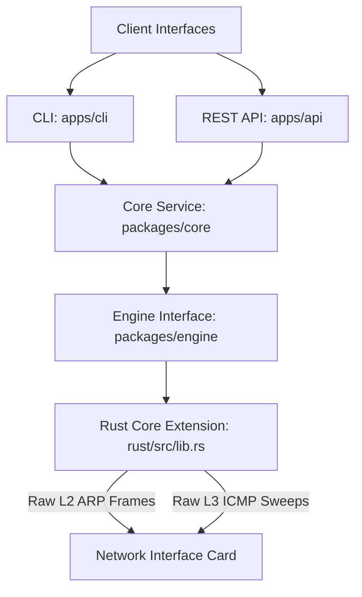

# ⚡ NetPulse

[](https://www.python.org/)
[](https://www.rust-lang.org/)
[](https://fastapi.tiangolo.com/)
[](LICENSE)

**NetPulse** is a high-performance, modern network discovery and analysis suite. It marries the speed and safety of low-level **Rust raw-socket packet crafting** with the developer ergonomics of **Python, FastAPI, and Typer**.

Designed as a modern monorepo, NetPulse is optimized for rapid Layer 2 (ARP) and Layer 3 (ICMP) network sweeps.

---

## 📐 System Architecture

NetPulse is structured as a modular monorepo that separates high-speed systems execution (Rust) from orchestration, validation, and delivery interfaces (CLI, REST API).



---

## 📂 Monorepo Layout

| Component Path | Language | Description |
| :--- | :--- | :--- |
| [**`rust/`**](file:///home/bonheur/netpulse/rust) | Rust | High-speed native core utilizing raw sockets (`pnet`, `socket2`) for ARP framing and ICMP sweeps. |
| [**`packages/core/`**](file:///home/bonheur/netpulse/packages/core) | Python | Central orchestration layer (`netpulse_core`). Defines domain Pydantic V2 models and handles service coordination. |
| [**`packages/engine/`**](file:///home/bonheur/netpulse/packages/engine) | Python | Loader package (`netpulse_engine`) exposing compiled Rust bindings to Python, featuring a zero-privilege mock fallback. |
| [**`apps/cli/`**](file:///home/bonheur/netpulse/apps/cli) | Python | Premium CLI tool (`netpulse_cli`) powered by `Typer` and `Rich` for beautiful terminal data representation. |
| [**`apps/api/`**](file:///home/bonheur/netpulse/apps/api) | Python | Production-ready FastAPI service (`netpulse_api`) featuring custom rate-limiters, security headers, and CORS restrictions. |
| [**`tests/`**](file:///home/bonheur/netpulse/tests) | Python | Complete automated test suite verifying models, mock engine interfaces, CLI, and API layers. |

---

## 🔒 Security & Elevated Privileges

Because L2 ARP (ethernet frames) and L3 ICMP (ping) sweeps open and read from raw network sockets, they require systems-level privileges under Linux.

### 🛡️ Local Testing (Mock Mode)
To build and test NetPulse locally without needing root privileges, you can activate **Forced Mock Mode** by exporting the environment variable:
```bash
export NETPULSE_MOCK=1
```
In mock mode, the Python engine will bypass the Rust raw socket layer and return simulated subnets instantly, preserving full layout, validation, and API testing capabilities.

### ⚡ Running in Native Production Mode
When executing real scans on a network interface card, you must provide the python interpreter with standard Linux network capabilities or run with superuser rights:

*   **Option A (Recommended): Grant capabilities to the virtualenv Python binary**
    ```bash
    sudo setcap cap_net_raw,cap_net_admin+eip $(readlink -f .venv/bin/python)
    ```
*   **Option B: Execute via superuser (`sudo`)**
    ```bash
    sudo .venv/bin/python apps/cli/netpulse_cli/main.py discover 192.168.1.0/24
    ```

---

## 🚀 Installation & Build

NetPulse uses [`uv`](https://github.com/astral-sh/uv) to manage its dependencies, and compiles its Rust engine inline using [`maturin`](https://github.com/PyO3/maturin).

### Prerequisites
Ensure you have Rust, cargo, and python installed on your system.

### Steps
1.  **Clone the workspace** and navigate to the project directory:
    ```bash
    cd netpulse
    ```
2.  **Sync workspace dependencies** using `uv`:
    ```bash
    uv sync
    ```
3.  **Compile and register the Rust engine** inside the virtual environment:
    ```bash
    cd rust
    ../.venv/bin/maturin develop --release
    cd ..
    ```

---

## 🖥️ Command Line Interface (CLI)

The CLI offers stunning console aesthetics with dynamic loading states, table outputs, and detailed error instructions.

### Subcommands
*   **`version`**: Shows package and CLI version details.
*   **`discover [target]`**: Sweeps the target CIDR network.

### Execution Examples
```bash
# Standard interactive table sweep (requires root or setcap permissions)
sudo .venv/bin/python apps/cli/netpulse_cli/main.py discover 172.19.57.0/24

# Output results directly in formatted JSON
NETPULSE_MOCK=1 .venv/bin/python apps/cli/netpulse_cli/main.py discover 172.19.57.0/24 --format json

# Customize timeout and scan protocol
NETPULSE_MOCK=1 .venv/bin/python apps/cli/netpulse_cli/main.py discover 172.19.57.0/24 -m icmp -t 2000
```

---

## 🌐 REST API Service

The REST API is a secure, production-grade FastAPI web service.

### API Security Features
1.  **Strict Bind Address**: Exclusively listens on localhost (`127.0.0.1:8000`) for development, avoiding open exposures (`0.0.0.0`).
2.  **Sliding Window Rate Limiter**: Limits clients to **5 scans per minute per IP**, returning structured `429 Too Many Requests` responses with `retry_after_seconds` retry bounds.
3.  **Security Headers**: Emits strict headers on every response:
    *   `X-Content-Type-Options: nosniff`
    *   `X-Frame-Options: DENY`
    *   `Content-Security-Policy: default-src 'self';`
4.  **CORS Restrictions**: Rejects wildcards (`*`) and explicitly boundaries access to `localhost:3000` developers.
5.  **Structured Error Translation**: Safe handling of raw socket `PermissionError` codes, translating them into helpful instructions.

### Start the REST Server
```bash
# Run in Mock Mode (Unprivileged)
PYTHONPATH=apps/api NETPULSE_MOCK=1 .venv/bin/python -m uvicorn netpulse_api.main:app --host 127.0.0.1 --port 8000

# Run in Production Mode (Requires raw socket capabilities)
sudo PYTHONPATH=apps/api .venv/bin/python -m uvicorn netpulse_api.main:app --host 127.0.0.1 --port 8000
```

### Endpoint Reference

#### `GET /health`
Validates server reachability and responds with compliancy metadata.
*   **Response (200)**:
    ```json
    {
      "status": "healthy",
      "service": "netpulse-api",
      "timestamp": 1779482308.33
    }
    ```

#### `POST /api/v1/discover`
Orchestrates a discovery scan.
*   **Request Payload**:
    ```json
    {
      "target_network": "172.19.57.0/24",
      "methods": ["icmp"],
      "timeout_ms": 1000
    }
    ```
*   **Response (200)**:
    ```json
    {
      "id": "7b86da45-ad65-4b55-b200-92a41a71a998",
      "network": "172.19.57.0/24",
      "methods": ["icmp"],
      "status": "completed",
      "errors": [],
      "devices": [
        {
          "id": "e38d70be-71fa-4677-962a-62bbb3685394",
          "ip": "172.19.57.1",
          "mac": null,
          "hostname": null,
          "vendor": null,
          "status": "up",
          "rtt_ms": 0.35
        }
      ],
      "started_at": "2026-05-22T20:47:32.256Z",
      "finished_at": "2026-05-22T20:47:32.257Z",
      "stats": {
        "scanned": 256,
        "responsive": 1
      },
      "metadata": {}
    }
    ```

---

## 🧪 Running Automated Tests

NetPulse comes with **26 automated unit and integration tests** built on top of `pytest` and `httpx`.

Tests run securely inside the local sandbox using mock overrides without needing root/sudo permissions:

```bash
PYTHONPATH=apps/api:apps/cli:packages/core:packages/engine NETPULSE_MOCK=1 .venv/bin/pytest tests/ -v
```